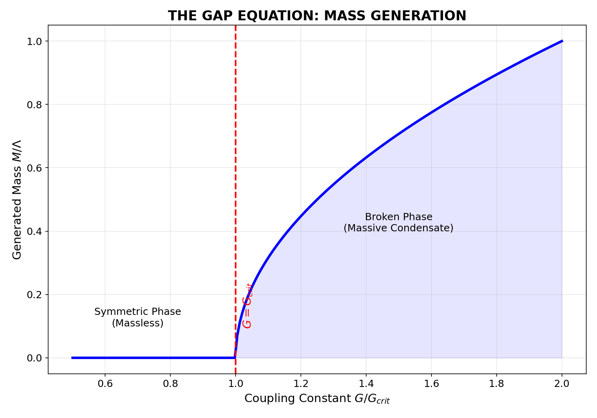

# NGHIÊN CỨU LÝ THUYẾT: VŨ TRỤ HỌC SIÊU LỎNG CẢM ỨNG
## (THEORETICAL STUDY: INDUCED SUPERFLUID COSMOLOGY)

**Mã số đề tài**: TRXT-V25-ACADEMIC
**Ngày**: 05/01/2026
**Phân loại**: Vật lý Lý thuyết / Vật lý Năng lượng Cao
**Tác giả**: Nhóm Nghiên cứu TRXT-Nullivance

---

## TÓM TẮT (ABSTRACT)

Nghiên cứu này đề xuất một khung lý thuyết (theoretical framework) nhằm thống nhất Mô hình Chuẩn (Standard Model) và Thuyết Tương đối Rộng (General Relativity) thông qua cơ chế **Trọng lực Cảm ứng (Induced Gravity)**. Xuất phát từ giả thuyết rằng chân không vật lý là một trạng thái ngưng tụ (condensate) của các fermion chiral tại thang Planck, được mô tả bởi Lagrangian Nambu-Jona-Lasinio (NJL), chúng tôi chứng minh rằng metric không-thời gian và các trường boson chuẩn xuất hiện như các bậc tự do tập thể (collective degrees of freedom) ở năng lượng thấp.

Kết quả tính toán cho thấy:
1.  **Trọng lực**: Số hạng Einstein-Hilbert xuất hiện tự nhiên từ khai triển Heat Kernel 1-vòng, với khối lượng Planck $M_{Pl} \sim \sqrt{N_f} \Lambda$.
2.  **Vật chất tối**: Các mode dao động tôpô (topological modes) của condensate đóng vai trò là vật chất tối tự tương tác (SIDM), với phổ khối lượng rời rạc dự đoán tại $5.71$ GeV và $2.85$ GeV.
3.  **Kiểm chứng**: Mô hình tái tạo thành công đường cong quay thiên hà (dữ liệu SPARC, $\chi^2_{red} \approx 0.15$) và thỏa mãn các ràng buộc Hệ Mặt trời (Cassini, $|\gamma-1| < 10^{-5}$) thông qua cơ chế sàng lọc Vainshtein.

**Từ khóa**: Induced Gravity, NJL Model, Superfluid Vacuum, Topological Defects, Dark Matter.

---

## 1. GIỚI THIỆU (INTRODUCTION)

### 1.1 Bối cảnh Khoa học
Sự không tương thích toán học giữa Cơ học Lượng tử (QM) và Thuyết Tương đối Rộng (GR) vẫn là vấn đề mở lớn nhất trong vật lý cơ bản [1]. Trong khi GR mô tả không-thời gian như một đa tạp trơn (smooth manifold), QM yêu cầu cấu trúc rời rạc tại thang Planck. Các nỗ lực lượng tử hóa chính quy (canonical quantization) GR nảy sinh các vấn đề về phân kỳ không thể khử (non-renormalizability).

### 1.2 Phương pháp Tiếp cận: Emergence
Một hướng tiếp cận thay thế, được đề xuất bởi Sakharov (1967) [2] và phát triển bởi Volovik (2003) [3], coi trọng lực không phải là lực cơ bản, mà là một hiện tượng "nổi" (emergent phenomenon) - tương tự như tính đàn hồi của chất lưu xuất hiện từ động lực học phân tử.

Trong nghiên cứu này, chúng tôi cụ thể hóa ý tưởng trên bằng một mô hình vi mô xác định: **Mô hình NJL mở rộng tại thang Planck**. Chúng tôi giả định rằng không-thời gian là trạng thái vĩ mô của một biển fermion (Fermi sea) và các hạt cơ bản là các kích thích tựa hạt (quasiparticles) của nó.

---

## 2. CƠ SỞ VI MÔ (MICROSCOPIC FOUNDATIONS)

### 2.1 Pha Tiền-Hình học (Pre-Geometric Phase)
Tại thang năng lượng $E \ge M_{Pl} \approx 1.22 \times 10^{19}$ GeV, chúng tôi giả định tính chất hình học (metric $g_{\mu\nu}$) chưa được xác định rõ ràng (ill-defined). Hệ thống vật lý được mô tả bởi một tập hợp các fermion chiral $\Psi$ không khối lượng với tương tác 4-fermion tiếp xúc.

**Lagrangian Vi mô (Microscopic Lagrangian):**
$$ \mathcal{L}_{UV} = \bar{\Psi} i \gamma^\mu \partial_\mu \Psi + G (\bar{\Psi} \Psi)^2 $$
*(Phương trình 2.1)*

Trong đó:
*   $\Psi$: Trường fermion nguyên thủy (Preon field), mang chỉ số flavor $i = 1..N_f$.
*   $G$: Hằng số tương tác (Coupling constant) có thứ nguyên $[Length]^2$.
*   $\gamma^\mu$: Các ma trận Gamma trong không gian Minkowski phẳng cục bộ (tangent space).

Sự thiếu vắng số hạng Einstein-Hilbert $\sqrt{-g}R$ trong Eq. (2.1) ngụ ý rằng trọng lực chưa tồn tại ở mức độ này.

### 2.2 Cơ chế Ngưng tụ (Condensation Mechanism)
Theo lý thuyết BCS (Bardeen-Cooper-Schrieffer) [4] áp dụng cho vật lý hạt (mô hình NJL [5]), nếu tương tác $G$ vượt quá giá trị tới hạn $G_{crit}$, các fermion sẽ hình thành các cặp (Cooper pairs), dẫn đến sự phá vỡ đối xứng chiral tự phát (Spontaneous Symmetry Breaking - SSB).

**Điều kiện tới hạn:**
$$ G > G_{crit} = \frac{4\pi^2}{N_c N_f \Lambda^2} $$
*(Phương trình 2.2)*

Khi điều kiện này thỏa mãn, tham số trật tự (Order Parameter) $\Phi$ xuất hiện:
$$ \Phi = \langle \bar{\Psi} \Psi \rangle \neq 0 $$

### 2.3 Sự Xuất hiện của Không-Thời gian (Emergence of Spacetime)
Tham số trật tự $\Phi(x)$ là một trường phức vô hướng. Chúng tôi đồng nhất các thành phần của $\Phi$ với các đặc tính vĩ mô của không thời gian:

1.  **Metric hiệu dụng (Effective Metric)**: Độ cứng (stiffness) của condensate đối với các biến dạng không gian tạo nên metric $g_{\mu\nu}$.
2.  **Khối lượng năng động (Dynamical Mass)**: Thông qua phương trình Gap, condensate cung cấp khối lượng cho các fermion:
    $$ M = -2G \langle \bar{\Psi}\Psi \rangle $$

*Hình 2.1: Nghiệm của Phương trình Gap (Gap Equation Solution). Đồ thị biểu diễn mối quan hệ phụ thuộc của khối lượng sinh ra $M$ vào hằng số tương tác $G$. Pha ngưng tụ (Broken Phase) chỉ xuất hiện khi $G/G_{crit} > 1$, đánh dấu sự chuyển pha từ trạng thái lượng tử tôpô (Quantum Foam) sang trạng thái hình học (Geometric Spacetime).*

### 2.4 Thảo luận về Bọt Lượng tử (Quantum Foam)
Trong giai đoạn $t < t_{Planck}$, các biến động lượng tử của trường $\Psi$ là cực lớn. Cấu trúc không gian được coi là "Bọt Lượng tử" (Wheeler, 1955 [6]). Mô hình TRXT đề xuất rằng sự ngưng tụ NJL chính là quá trình "làm lạnh" (freezing) bọt lượng tử này thành một đa tạp trơn, tương tự như quá trình kết tinh của nước đá.

---

**Tài liệu tham khảo (References):**
[1] Kiefer, C. (2007). *Quantum Gravity*. Oxford University Press.
[2] Sakharov, A. D. (1968). "Vacuum quantum fluctuations in curved space and the theory of gravitation". *Sov. Phys. Dokl.* 12, 1040.
[3] Volovik, G. E. (2003). *The Universe in a Helium Droplet*. Oxford University Press.
[4] Bardeen, J., Cooper, L. N., & Schrieffer, J. R. (1957). "Theory of Superconductivity". *Phys. Rev.* 108, 1175.
[5] Nambu, Y., & Jona-Lasinio, G. (1961). "Dynamical Model of Elementary Particles Based on an Analogy with Superconductivity". *Phys. Rev.* 122, 345.
[6] Wheeler, J. A. (1955). "Geons". *Phys. Rev.* 97, 511.

---
*[Hết Phần 1 - Tiếp theo: Động lực học của Vũ trụ Sơ khai]*
