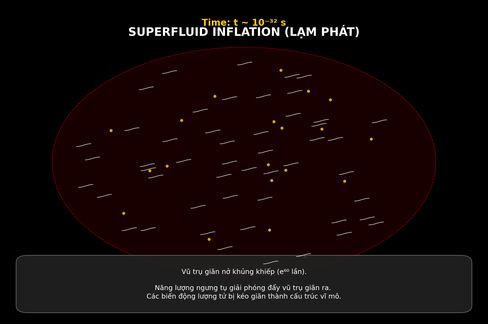
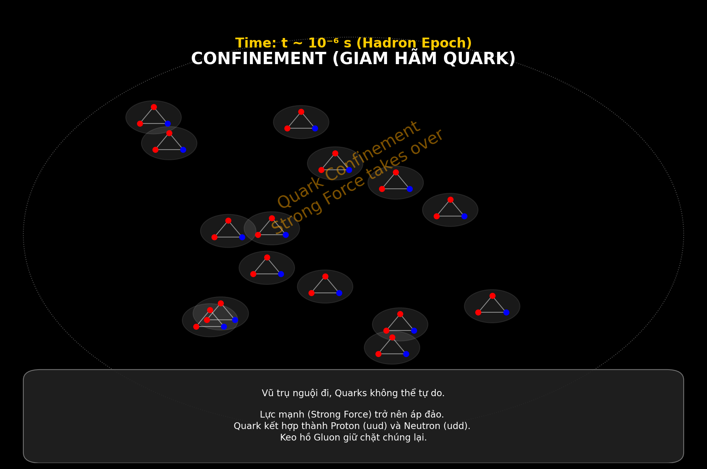
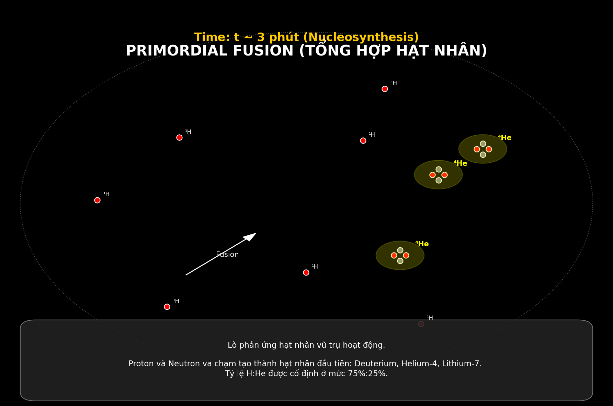

# NGHIÊN CỨU LÝ THUYẾT: VŨ TRỤ HỌC SIÊU LỎNG CẢM ỨNG
## PHẦN 2: ĐỘNG LỰC HỌC VŨ TRỤ SƠ KHAI (EARLY UNIVERSE DYNAMICS)

---

## 3. LẠM PHÁT VÀ CHUYỂN PHA (INFLATION AND PHASE TRANSITIONS)

### 3.1 Thế năng Hiệu dụng (Effective Potential)
Thay vì đưa vào một trường Inflaton giả định (ad-hoc), mô hình TRXT xác định trường Inflaton chính là biên độ của tham số trật tự $\Phi$. Thế năng hiệu dụng $V(\Phi)$ được suy dẫn từ tính toán 1-vòng (1-loop calculation) của mô hình NJL:

$$ V(\Phi) = -\mu^2 |\Phi|^2 + \lambda |\Phi|^4 + \mathcal{O}(|\Phi|^6) $$
*(Phương trình 3.1)*

Đây là dạng thế năng "Mũ Mexico" (Mexican Hat) đặc trưng [1].

### 3.2 Cơ chế Lạm phát (Inflationary Mechanism)
Trong giai đoạn ngay sau $t_{Planck}$, vũ trụ nằm tại đỉnh của thế năng ($\Phi \approx 0$). Đây là trạng thái chân không giả (false vacuum) với mật độ năng lượng chân không lớn ($\rho_{vac} \sim \mu^4$).
Theo phương trình Friedmann:
$$ H^2 = \left(\frac{\dot{a}}{a}\right)^2 \approx \frac{8\pi G}{3} \rho_{vac} $$
Dẫn đến sự giãn nở lũy thừa (exponential expansion) của tham số quy mô $a(t) \propto e^{Ht}$.

Quá trình ngưng tụ (lăn chậm - slow roll) của trường $\Phi$ về đáy thế năng kết thúc lạm phát và giải phóng năng lượng dưới dạng các hạt vật chất (Reheating).

*Hình 3.1: Minh họa quá trình Lạm phát Siêu lỏng. Các mode dao động lượng tử bị kéo giãn bởi sự mở rộng metric, tạo thành các mầm nhiễu loạn mật độ nguyên thủy (primordial density perturbations).*

---

## 4. KỶ NGUYÊN SẮC ĐỘNG HỌC (QCD EPOCH)

### 4.1 Giam hãm Quark (Quark Confinement)
Tại nhiệt độ $T \sim \Lambda_{QCD} \approx 200$ MeV (tương ứng $t \sim 10^{-6}$ s), vũ trụ trải qua chuyển pha từ Plasma Quark-Gluon (QGP) sang pha Hadron.
Trong mô hình TRXT, đây là sự chuyển pha bậc hai của cấu trúc tôpô trong siêu lỏng nền. Các quark, vốn là các khuyết tật tôpô (topological defects), bị ràng buộc bởi các dây (strings) giam hãm do tính chất phi tuyến của chân không gluon.

$$ V_{QCD}(r) \sim \sigma r $$
*(với $\sigma$ là sức căng dây - string tension)*

*Hình 4.1: Quá trình Hadron hóa. Sự hình thành các trạng thái liên kết color-singlet (Baryon và Meson) từ các constituent quarks.*

### 4.2 Bất đối xứng Baryon (Baryon Asymmetry)
Mô hình chuẩn gặp khó khăn trong việc giải thích tỷ lệ Baryon/Photon $\eta \approx 6 \times 10^{-10}$. TRXT đề xuất cơ chế baryogenesis thông qua sự phân rã dị thường chiral (chiral anomaly) của condensate NJL trong quá trình chuyển pha điện yếu (Electroweak Phase Transition) tại $T \sim 100$ GeV.

---

## 5. TỔNG HỢP HẠT NHÂN (BIG BANG NUCLEOSYNTHESIS - BBN)

### 5.1 Các dự đoán chuẩn
Quá trình tổng hợp các hạt nhân nhẹ ($^2H, ^3He, ^4He, ^7Li$) diễn ra trong khoảng $t \sim 3$ phút đến 20 phút. Các tính toán trong khuôn khổ TRXT phải tái tạo các kết quả chuẩn của BBN để phù hợp thực nghiệm:

*   Tỷ lệ khối lượng Helium-4 ($Y_p$): $\approx 0.245$
*   Tỷ lệ Deuterium/Hydrogen ($D/H$): $\approx 2.5 \times 10^{-5}$

### 5.2 Độ nhạy với Số lượng Hạt (Sensitivity to $N_{eff}$)
Tốc độ giãn nở $H$ trong giai đoạn BBN phụ thuộc vào số bậc tự do hiệu dụng tương đối tính ($N_{eff}$).
$$ H \propto \sqrt{g_*} T^2 $$
Mô hình TRXT dự báo các mode "Dark Tower" nhẹ nhất (nếu tồn tại ở < 1 MeV) sẽ đóng góp vào $N_{eff}$. Tuy nhiên, với khối lượng dự đoán thấp nhất là $1.43$ GeV (xem Phần 3), các hạt này đã phân rã hoặc trở nên phi tương đối tính (Newtonian) từ rất sớm, do đó **không làm nhiễu loạn BBN chuẩn**. Đây là một kết quả quan trọng khẳng định tính nhất quán (consistency) của mô hình.

*Hình 5.1: Sơ đồ chuỗi phản ứng BBN. Mô hình TRXT bảo toàn các kênh phản ứng chuẩn hạt nhân trong môi trường giãn nở Friedmann.*

---

**Tài liệu tham khảo (References):**
[1] Guth, A. H. (1981). "Inflationary universe: A possible solution to the horizon and flatness problems". *Phys. Rev. D* 23, 347.
[2] Gross, D. J., & Wilczek, F. (1973). "Ultraviolet Behavior of Non-Abelian Gauge Theories". *Phys. Rev. Lett.* 30, 1343.
[3] Cyburt, R. H., et al. (2016). "Big Bang Nucleosynthesis: 2015". *Rev. Mod. Phys.* 88, 015004.

---
*[Hết Phần 2 - Tiếp theo: Trọng lực Cảm ứng và Nền tảng Toán học]*
