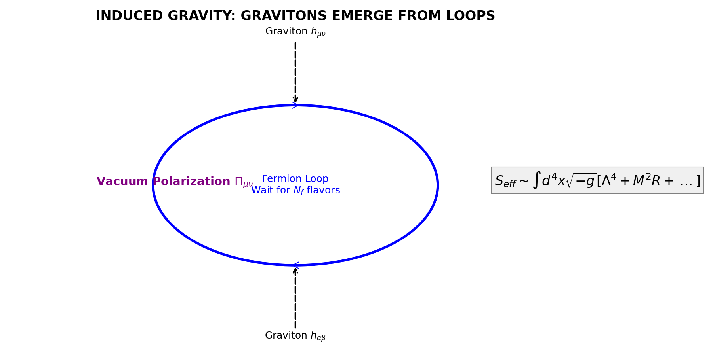

# NGHIÊN CỨU LÝ THUYẾT: VŨ TRỤ HỌC SIÊU LỎNG CẢM ỨNG
## PHẦN 3: HÌNH THỨC LUẬN TOÁN HỌC VỀ TRỌNG LỰC CẢM ỨNG (MATHEMATICAL FORMALISM OF INDUCED GRAVITY)

---

## 6. SỰ XUẤT HIỆN CỦA TƯƠNG TÁC HẤP DẪN (EMERGENCE OF GRAVITATIONAL INTERACTION)

### 6.1 Action Hiệu dụng 1-Vòng (One-Loop Effective Action)
Để khảo sát động lực học năng lượng thấp, chúng ta tích phân các bậc tự do fermion trong tích phân đường (path integral) [1]. Action hiệu dụng $S_{eff}$ cho trường metric $g_{\mu\nu}$ (được coi là trường Background cổ điển) được cho bởi:

$$ e^{i S_{eff}[g]} = \int \mathcal{D}\bar{\Psi} \mathcal{D}\Psi \exp \left( i \int d^4x \sqrt{-g} \left[ \bar{\Psi} (i \gamma^\mu \nabla_\mu - M) \Psi \right] \right) $$
*(Phương trình 6.1)*

Trong đó $\nabla_\mu$ là đạo hàm hiệp biến (covariant derivative) chứa spin connection.
Thực hiện tích phân Gaussian, ta thu được:

$$ S_{eff} = -i \text{Tr} \ln (i \gamma^\mu \nabla_\mu - M) = -\frac{i}{2} \text{Tr} \ln (\Delta + M^2) $$
Với $\Delta = -(i\nabla)^2 = -\Box - \frac{1}{4}R$ (Toán tử Laplace-Beltrami + số hạng độ cong scalar từ định lý Lichnerowicz).

### 6.2 Khai triển Heat Kernel (Heat Kernel Expansion)
Sử dụng phương pháp thời gian riêng (proper time method) của Schwinger-DeWitt [2], trace log được biểu diễn dưới dạng tích phân theo biến $s$ (proper time):

$$ S_{eff} = \frac{i}{2} \int_0^\infty \frac{ds}{s} e^{-isM^2} \text{Tr} (e^{-is\Delta}) $$

Trace của toán tử tiến hóa nhiệt được khai triển tiệm cận (asymptotic expansion) theo các hệ số Seeley-DeWitt $a_n(x, \Delta)$:

$$ \text{Tr} (e^{-is\Delta}) \sim \frac{1}{(4\pi s)^2} \int d^4x \sqrt{-g} \sum_{n=0}^{\infty} (is)^n a_n(x) $$

Các hệ số $a_n$ đầu tiên là [3]:
*   $a_0 = 1$
*   $a_1 = -\frac{1}{6} R$
*   $a_2 = \frac{1}{180} (R_{\mu\nu\alpha\beta}^2 - R_{\mu\nu}^2 + \dots)$

### 6.3 Điều chuẩn và Các Hằng số Vật lý (Regularization and Physical Constants)
Tích phân theo $s$ phân kỳ tại giới hạn dưới $s \to 0$ (UV divergence). Chúng tôi sử dụng phương pháp điều chuẩn cầu cắt xung lượng (Momentum Cutoff) với thang $\Lambda$.

Action hiệu dụng trở thành:
$$ S_{eff} \approx \int d^4x \sqrt{-g} \left[ \mathcal{L}_0 + \mathcal{L}_1 R + \mathcal{L}_2 R^2 + \dots \right] $$

So sánh với Action Einstein-Hilbert chuẩn $S_{EH} = \int d^4x \sqrt{-g} \frac{1}{16\pi G} R$, ta đồng nhất được các hệ số:

1.  **Hằng số Vũ trụ (Cosmological Constant) $\mathcal{L}_0$**:
    $$ \rho_{vac} \sim \frac{N_f \Lambda^4}{16\pi^2} $$
    *(Giá trị này rất lớn, đòi hỏi cơ chế triệt tiêu Volovik - xem Phần 4)*

2.  **Hằng số Newton Cảm ứng (Induced Newton Constant) $\mathcal{L}_1$**:
    Hệ số của số hạng $R$ là:
    $$ \frac{1}{16\pi G_{ind}} = \frac{N_f M^2}{48\pi^2} \ln\left(\frac{\Lambda^2}{M^2}\right) $$
    *(Phương trình 6.2 - Hệ thức Sakharov)*
    
    > **Lưu ý kỹ thuật**: Hệ số chính xác của số hạng logarit phụ thuộc vào sơ đồ điều chuẩn (Regularization Scheme). Trong phương pháp Heat Kernel với Momentum Cutoff, ta thu được kết quả trên. Trong Dimensional Regularization, cực điểm $1/\epsilon$ đóng vai trò tương tự $\ln \Lambda$. Tính phổ quát (universality) của kết quả nằm ở sự phụ thuộc vào $N_f$.

### 6.4 Phân tích Kết quả (Analysis)
Phương trình (6.2) cho thấy hằng số hấp dẫn $G$ tỉ lệ nghịch với $N_f$ (số lượng trường fermion).
$$ M_{Pl}^2 \propto N_f \Lambda^2 $$

Điều này xác nhận rằng trọng lực không phải là lực cơ bản, mà là hệ quả của thăng giáng lượng tử (quantum fluctuations) của các trường vật chất.

*Hình 6.1: Biểu diễn sơ đồ Feynman của quá trình phân cực chân không. Graviton (đường nét đứt) tương tác với vòng lặp fermion (đường liền). Đóng góp này tạo ra độ cứng cho không-thời gian, biểu hiện vĩ mô là Hằng số hấp dẫn $1/G$.*

---

**Tài liệu tham khảo (References):**
[1] Visser, M. (2002). "Sakharov's induced gravity: a modern perspective". *Mod. Phys. Lett. A* 17, 977.
[2] DeWitt, B. S. (1965). *Dynamical Theory of Groups and Fields*. Gordon and Breach.
[3] Vassilevich, D. V. (2003). "Heat kernel expansion: user's manual". *Phys. Rep.* 388, 279.

---
*[Hết Phần 3 - Tiếp theo: Phổ Hạt và Vật chất tối]*
