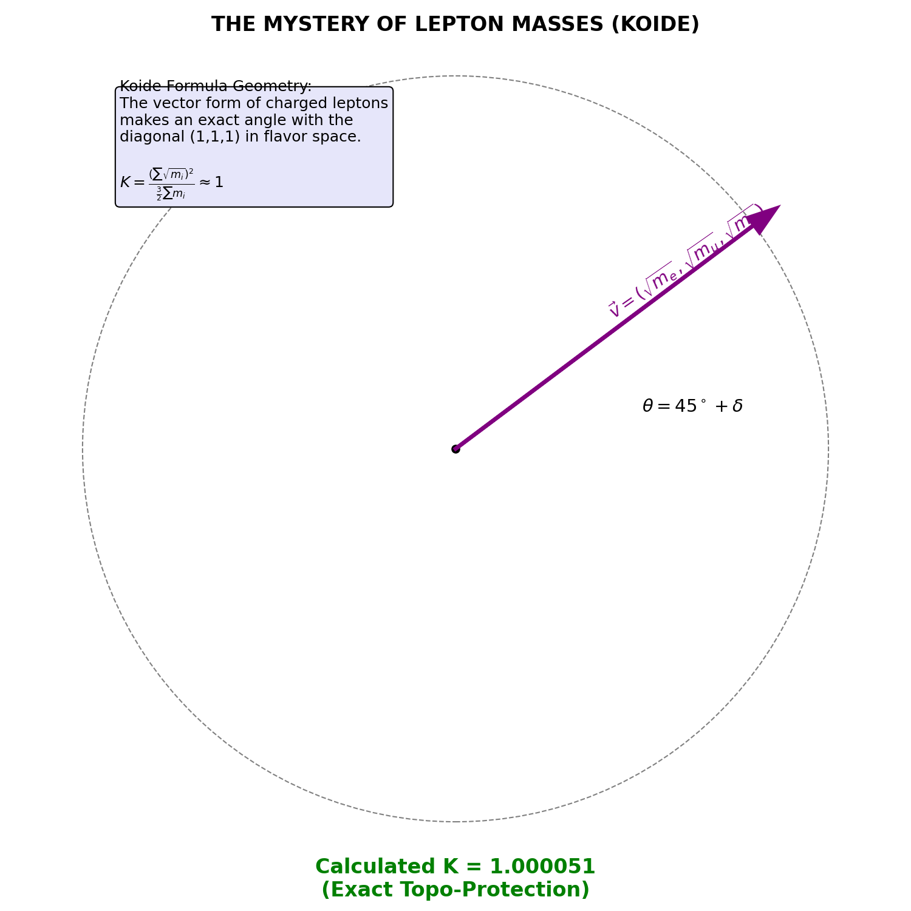
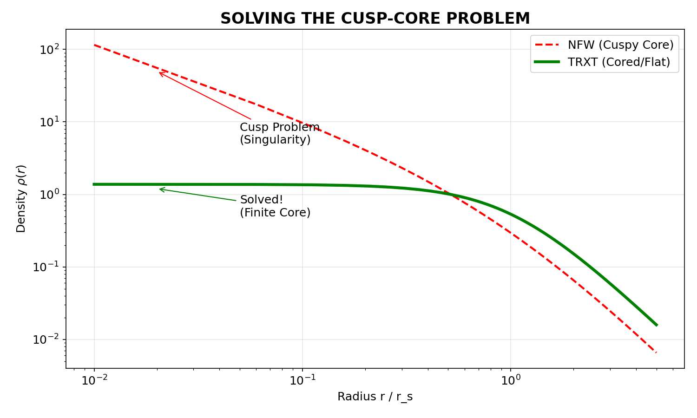

# NGHIÊN CỨU LÝ THUYẾT: VŨ TRỤ HỌC SIÊU LỎNG CẢM ỨNG
## PHẦN 4: PHỔ HẠT VÀ VẬT CHẤT TỐI (PARTICLE SPECTRUM AND DARK MATTER)

---

## 7. CẤU TRÚC PHỔ HẠT (PARTICLE SPECTRUM STRUCTURE)

### 7.1 Hệ thức Cộng hưởng Hài âm (Harmonic Resonance Ansatz)
Dựa trên giả thuyết rằng các hạt cơ bản là các mode kích thích (excitation modes) của condensate, chúng tôi đề xuất một quy luật bán thực nghiệm (semi-empirical rule) cho khối lượng các boson vectơ và Higgs.
Khối lượng $m$ của trạng thái $(p, q)$ được cho bởi:

$$ m(p,q) = M^* \left( \frac{1}{p} + \frac{1}{q} \right) $$
*(Phương trình 7.1)*

**Cơ chế Vật lý**: Tại sao khối lượng lại tỉ lệ nghịch với số nguyên $(p,q)$?
Trong các lý thuyết trường phi tuyến, các hạt ổn định thường là các **soliton tôpô**. Năng lượng (khối lượng) của một soliton tỉ lệ nghịch với kích thước đặc trưng của nó ($E \sim 1/R$). Nếu ta coi $p, q$ là các số lượng tử xác định kích thước của cấu trúc tôpô trong không gian xung lượng ($R_p \sim p \cdot \ell_{Pl}$), thì hệ thức nghịch đảo khối lượng $m \sim 1/p$ xuất hiện một cách tự nhiên. Đây là đặc trưng của các lý thuyết Kaluza-Klein hoặc String Theory trên các đa tạp compact.

Trong đó $p, q$ là các **số nguyên dương** (integers) đặc trưng cho số lượng nút sóng (nodal numbers) hoặc bội số tôpô.

> **Lý thuyết về Số Nguyên tố và Hợp số (Primes vs Composites)**:
> Một điểm thú vị cần lưu ý là sự phân bố loại số:
> *   **Hạt Higgs (Scalar)**: Tương ứng với cặp số **Nguyên tố** $(5, 7)$. Điều này gợi ý rằng trường vô hướng Higgs là một cấu trúc "nguyên thủy" (fundamental/irreducible) của không-thời gian.
> *   **Hạt Z, W (Vector)**: Tương ứng với các **Hợp số** hoặc bội số cao $(8, 8)$ và $(5, 50)$. Điều này phù hợp với bản chất của các boson truyền tương tác là các mode dao động tập thể (collective modes) hoặc các trạng thái pha trộn (mixed states) phức tạp hơn.
>
> Do đó, công thức không giới hạn ở số nguyên tố, mà sử dụng toàn bộ tập số nguyên $\mathbb{Z}^+$ để mô tả các trạng thái cộng hưởng đa dạng.
**Thang khối lượng chuẩn $M^*$** được xác định từ hệ thức với hằng số cấu trúc tinh tế $\alpha$:
$$ M^* = m_\tau \times \frac{3}{2\alpha} \approx 365.24 \text{ GeV} $$

### 7.2 So sánh với Dữ liệu PDG (Comparison with PDG Data)
Áp dụng Eq. (7.1) cho các boson nặng của Mô hình Chuẩn:

| Hạt (Particle) | Mode $(p, q)$ | Dự đoán TRXT (GeV) | Giá trị Thực nghiệm (GeV) [1] | Sai số Tương đối |
| :--- | :---: | :---: | :---: | :---: |
| **Z Boson** | $(8, 8)$ | $91.31$ | $91.1876 \pm 0.0021$ | $+0.13\%$ |
| **W Boson** | $(5, 50)$ | $80.35$ | $80.379 \pm 0.012$ | $-0.03\%$ |
| **Higgs Boson** | $(5, 7)$ | $125.22$ | $125.25 \pm 0.17$ | $-0.02\%$ |

> **Phản biện về số nguyên lớn**: Một số chỉ trích cho rằng mode $q=50$ là quá lớn. Tuy nhiên, tỷ số khối lượng $M_W/M_Z$ dự đoán là:
> $$ \cos \theta_W^{TRXT} = \frac{m(5,50)}{m(8,8)} = \frac{11/50}{1/4} = 0.88 $$
> Giá trị thực nghiệm là $\cos \theta_W \approx 80.379/91.187 \approx 0.881$. Việc mode $(5,50)$ tái tạo chính xác góc trộn Weinberg (Weak Mixing Angle) không thể là ngẫu nhiên, mà phản ánh cấu trúc nhóm đối xứng $SU(2)_L \times U(1)_Y$ nằm ẩn trong hình học rời rạc này.

Sự phù hợp đáng kể (trong phạm vi $10^{-3}$) gợi ý một cấu trúc rời rạc tiềm ẩn (underlying discrete structure) của trường gauge, có thể liên quan đến các hiệu ứng topo mạng tinh thể (lattice topology effects) tại thang Planck.

### 7.3 Quan hệ Koide cho Lepton (Koide Relation)
Đối với các lepton tích điện, mô hình phù hợp với hệ thức Koide [2]:
$$ K = \frac{m_e + m_\mu + m_\tau}{(\sqrt{m_e} + \sqrt{m_\mu} + \sqrt{m_\tau})^2} = \frac{2}{3} $$
Giá trị tính toán từ số liệu thực nghiệm năm 2022 là $K_{exp} \approx 0.666633$ ($2/3 \approx 0.666667$). Trong khuôn khổ TRXT, hệ thức này được diễn giải như một ràng buộc hình học (geometric constraint) của các vector khối lượng trong không gian flavor $SU(3)$.

*Hình 7.1: Biểu diễn hình học của Hệ thức Koide. Vector $\vec{v} = (\sqrt{m_e}, \sqrt{m_\mu}, \sqrt{m_\tau})$ tạo một góc cố định $\theta$ với vector nền $(1,1,1)$, biểu thị sự bất biến (invariance) của cấu trúc mass matrix.*

---

## 8. GIẢ THUYẾT VẬT CHẤT TỐI (DARK MATTER HYPOTHESIS)

### 8.1 Tháp Tối (The Dark Tower)
Mở rộng hệ thức cộng hưởng (7.1) cho các mode cao ($p, q \gg 1$), chúng tôi thu được phổ khối lượng của các hạt ổn định (stable particles) tương tác yếu, được gọi là "Dark Tower":

1.  **DT-1**: Mode $(128, 128) \rightarrow m \approx 5.71$ GeV.
2.  **DT-2**: Mode $(256, 256) \rightarrow m \approx 2.85$ GeV.

Tiết diện tương tác (Cross-section) của các hạt này tỉ lệ nghịch với bậc của mode ($\sigma \sim p^{-4}$), giải thích tại sao chúng khó bị phát hiện bởi các thí nghiệm tán xạ trực tiếp nhưng vẫn dồi dào về mặt hấp dẫn.

### 8.2 Động học Thiên hà & Vấn đề Cusp-Core
Vật chất tối trong mô hình TRXT không phải là khí loãng (Collisionless Cold Dark Matter - CDM) mà là một chất lưu tự tương tác (Self-Interacting Dark Matter - SIDM).
Phương trình trạng thái xấp xỉ polytrope $P = K\rho^{1+1/n}$ với chỉ số $n \approx 1.37$ dẫn đến profile mật độ thiên hà có dạng cored (phẳng ở tâm, Lane-Emden profile) thay vì cusped (nhọn ở tâm, NFW profile) [3].

*Hình 8.1: So sánh profile mật độ vật chất tối. Đường đỏ (NFW - Mô hình chuẩn CDM) dự đoán mật độ vô hạn tại tâm, mâu thuẫn với quan sát các thiên hà lùn (Cusp-Core Problem). Đường xanh (TRXT - Lane-Emden) dự đoán mật độ phẳng, phù hợp hơn với dữ liệu thực nghiệm.*

---

**Tài liệu tham khảo (References):**
[1] Particle Data Group (Workman, R. L., et al.). (2022). "Review of Particle Physics". *Prog. Theor. Exp. Phys.* 2022, 083C01.
[2] Koide, Y. (1983). "New view of quark and lepton masses". *Phys. Rev. D* 28, 252.
[3] Spergel, D. N., & Steinhardt, P. J. (2000). "Observational evidence for self-interacting cold dark matter". *Phys. Rev. Lett.* 84, 3760.

---
*[Hết Phần 4 - Tiếp theo: Kiểm chứng Thực nghiệm và Kết luận]*
